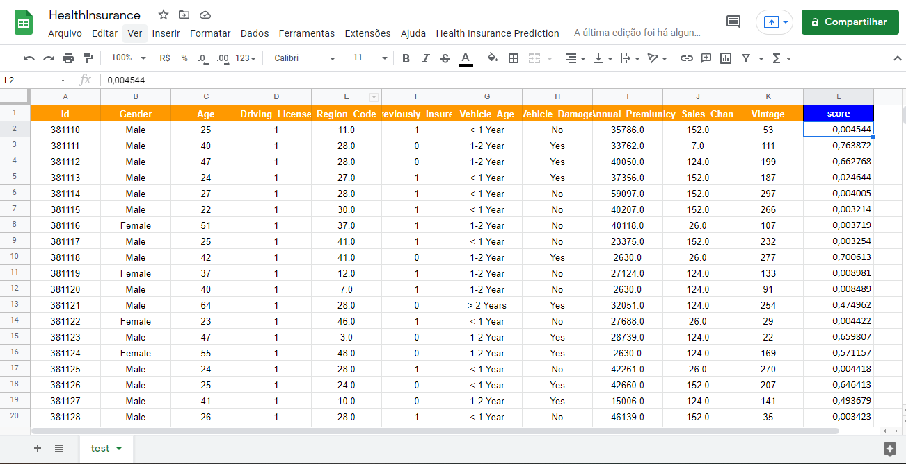
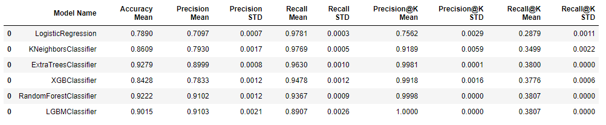
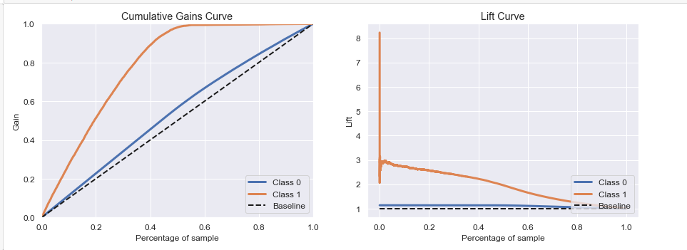
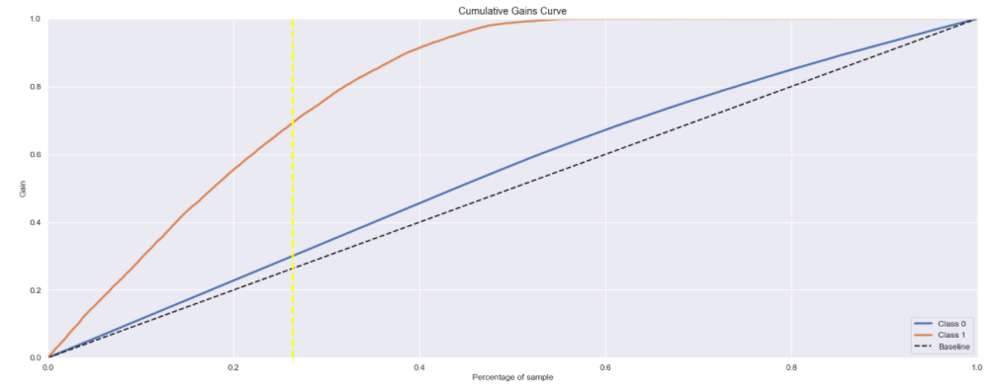
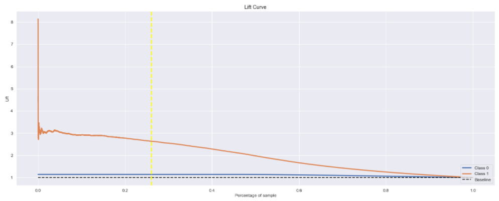
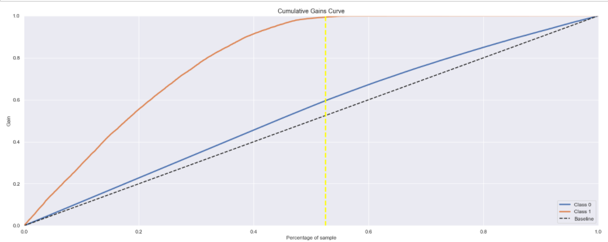
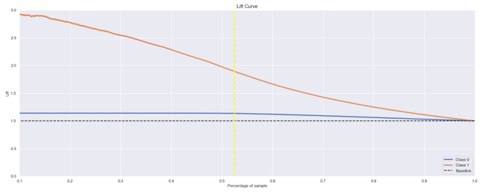

# Insurance All Company

Insurance All is a company that offers health insurance to its customers and the product team is analyzing the possibility of offering policyholders a new product: car insurance.

As with health insurance, customers of this new car insurance plan need to pay an amount annually to Insurance All in order to obtain an amount insured by the company, intended to cover an eventual accident or damage to the vehicle.

Insurance All conducted a survey of nearly 380,000 customers about their interest in joining a new auto insurance product last year. All customers expressed interest or not in purchasing auto insurance and these responses were saved in a database along with other customer attributes.

The product team selected 127,000 new customers who did not respond to the survey to participate in a campaign, in which they will receive an offer for the new auto insurance product. The offer will be made by the sales team through phone calls.

However, the sales team has the capacity to make 20 thousand calls during the campaign period.

# Business Problem

You were hired as a data science consultant to build a model that predicts whether or not the customer would be interested in auto insurance.

With the solution, the sales team hopes to be able to prioritize the people with the greatest interest in the new product and, thus, optimize the campaign by only making contact with the customers most likely to make the purchase.

As a result of your consultancy, you will need to deliver a report containing some analysis and answers to the following questions:

* Key insights into the most relevant attributes of customers interested in purchasing auto insurance.

* What percentage of customers interested in purchasing auto insurance can the sales force reach with 20,000 calls?

* And if the sales force capacity increases to 40,000 calls, what percentage of customers interested in purchasing auto insurance can the sales force contact?

* How many calls does the sales team need to make to reach 80% of customers interested in purchasing auto insurance?

# The Data

The dataset is available on the Kaggle platform via this link: https://www.kaggle.com/anmolkumar/health-insurance-cross-sell-prediction

Each row represents a customer, and each column contains some attributes that describe that customer, in addition to her response to the survey, in which she mentioned interest or not in the new insurance product.

# Solution planning

## What's the solution?
It is necessary to develop a machine learning model that ranks customers based on their likelihood of purchasing vehicle insurance.

## How will the solution be?
This Model will be available in an API, and can be used by the customer at any time he needs it.

## Deploy
The API will be hosted on the Heroku platform and is available at this url: health-insurance-prediction.herokuapp.com

## Google Sheets with prediction button

Access to the model's forecast result directly in a Google Sheets spreadsheet, facilitating the use by the call team, can be accessed through from the url: https://docs.google.com/spreadsheets/d/14Hzfr7wL_6B5ilLK7iF2DWrv1BQR-10khzza3kjcH9U/edit?usp=sharing

# Solution Strategy:

My strategy to solve this challenge was:

**Step 01. Data Description:** 
The initial DataSet has 381109 rows and 12 columns. The features are the following:

**ID:** Customer's identification
**Gender**: Customer's Gender
**Age**: Customer's Age
**Driving License**: 0 for customer without driving license and 1 customer with driving license
**Region Code**: Customer's region code
**Previously Insured**: 0, the client does not have car insurance and 1, the client already has car insurance.
**Vehicle Age**: Vehicle Age
**Vehicle Damage**: 0, customer has never had their vehicle damaged in the past and 1, customer has had their vehicle damaged in the past.
**Anual Premium**: Amount the customer paid the company for annual health insurance.
**Policy sales channel:**: Anonymous code for the customer contact channel.
**Vintage**: number of days the customer joined the company through the purchase of health insurance.
**Response**: 0, the customer is not interested and 1, the customer is interested.

**Step 02. Feature Engineering:** New features like were created to make possible a more thorough analysis.

**Step 03. Data Filtering:** In this step the entries containing no information or containing information which does not match the scope of the project were filtered out.

**Step 04. Exploratory Data Analysis:** univariate, bivariate and multivariate data analysis, obtaining statistical properties of each of them.

**Step 05. Data Preparation:** Prepare the data so that machine learning models can learn specific behavior. 

**Step 06. Feature Selection:** The most statistically relevant features were selected using the Algorithm ExtraTrees and using the feature_importances_ method.

**Step 07. Machine Learning Modelling:** Some machine learning models were trained. The one that presented best results after cross-validation went through a further stage of hyperparameter fine tunning to optimize the model's generalizability.

**Step 08. Hyperparameter Fine Tunning:** Hyperparameter fine tunning to optimize the model's generalizability.

**Step 09. Convert Model Performance to Business Values:** The models performance is converted into business values.

**Step 10. Deploy Modelo to Production:** The model is deployed on a cloud environment to make possible that other stakeholders and services access its results. The model was incorporated into a google spreadsheet where it predicts the propensity to buy the insurance.

# Top 3 Data Insights

**Hypothesis 1** - People aged 30 and over are more interested in insurance

**TRUE:** Approximately 87% of interested customers are over 30 years of age.

**Hypothesis 3** - Women are more interested in signing the insurance.

**FALSE:**  Men are more interested (61.17%) in purchasing vehicle insurance than women (38.83%).

**Hypothesis 8** - People who pay more for health insurance tend to subscribe to car insurance.

**FALSE:** Customers who spent less than $30,000 on insurance were the ones who most said they were interested in signing up for health insurance.

#  Machine Learning Model Applied
The following machine learning models were trained:

**KNN Classifier**

**Logistic Regression**

**Extra Tress**

**Random Forest**

**Light Gradient Boosting Machine Classifier**

**XGBoost Classifier**

##  Machine Learning Modelo Performance
The chosen model was **Extra Tress Classifier** because they have high performance on cross validation data.

# Converting model performance into business values

## What percentage of customers interested in purchasing auto insurance can the sales force reach with 20,000 calls?
By using 26% of test data, in which wold translate as 20 thousand calls by the sales team, the model would be able to identify 69% people out of the total people interested in purchasing the insurance

By Making 20 thousand calls, the model proposed is roughly 2,5 times better than random choice

revenue with random choice: $1.981772

revenue with model: $4.954430

Difference in $: $2.972658

## What percentage of customers interested in purchasing auto insurance can the sales force reach with 40,000 calls?
By using 52.47% of validation data, in which wold translate as 40 thousand calls by the sales team, the model would be able to identify 99.36% people out of the total people interested in purchasing the insurance.

By Making 40 thousand calls, the model proposed is roughly 1,6 times better than random choice.

                      
#  Conclusion:
This project was important to understand the concept of Learning to Rank(MLR) is the application of machine learning in the construction of ranking models for information retrieval systems.

There are several measures (metrics) which are commonly used to judge how well an algorithm is doing on training data and to compare the performance of different MLR algorithms. Often a learning-to-rank problem is reformulated as an optimization problem with respect to one of these metrics.

In this project i use the @k metrics because in the context of recommendation systems we are most likely interested in recommending top-N items to the callcenter. So it makes more sense to compute precision and recall metrics in the first N items instead of all the items. Thus the notion of precision and recall at k where k is a user definable integer that is set by the user to match the top-N recommendations objective.

#  Next Steps to improve:

- Create new features.
- Create a website or telegram bot with the ranking.
- Improve the interaction between API and spreadsheet so that users get more intuitive messages in case of errors.
- make hyperparameter fine tuning on a server using robust methods.
